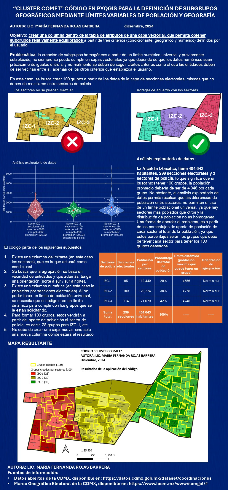
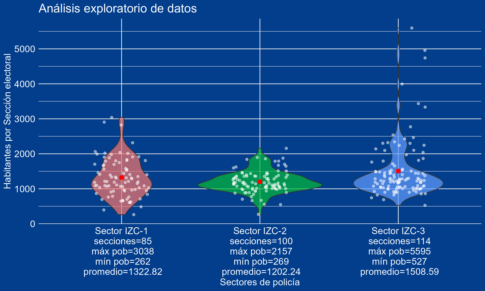
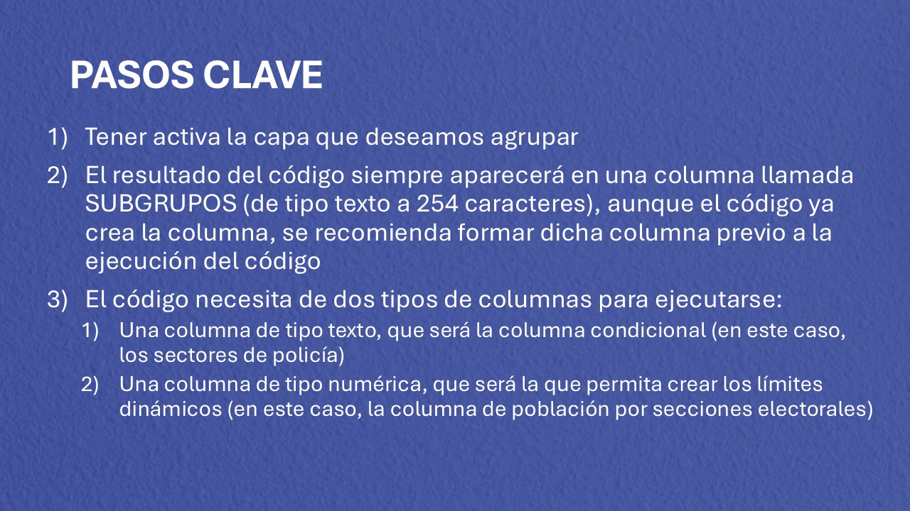
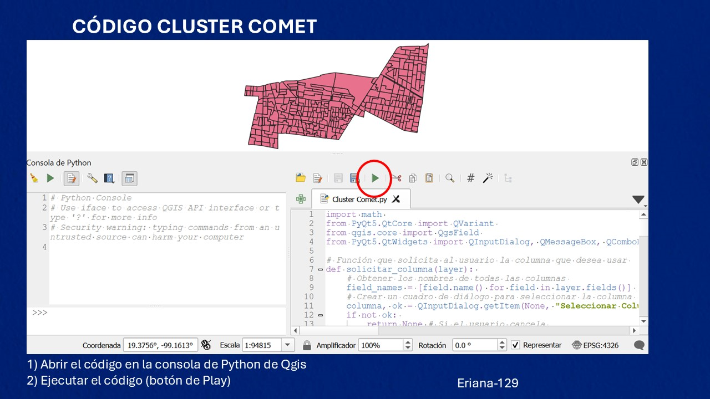
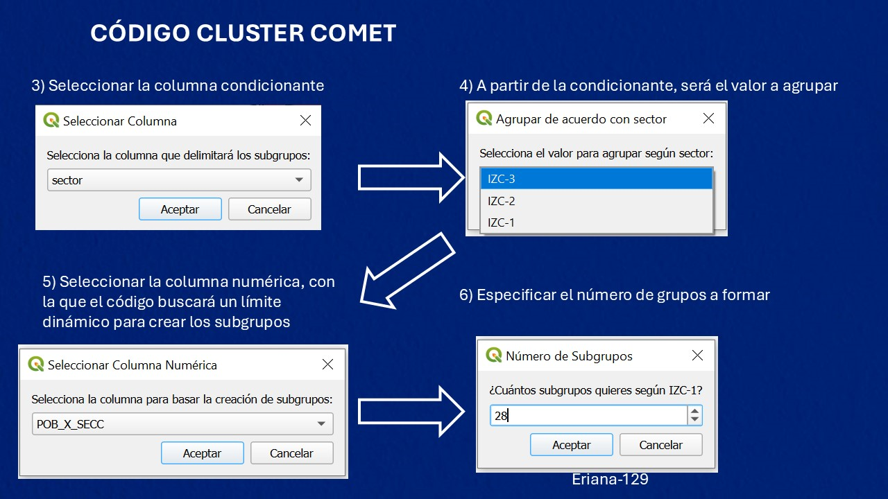
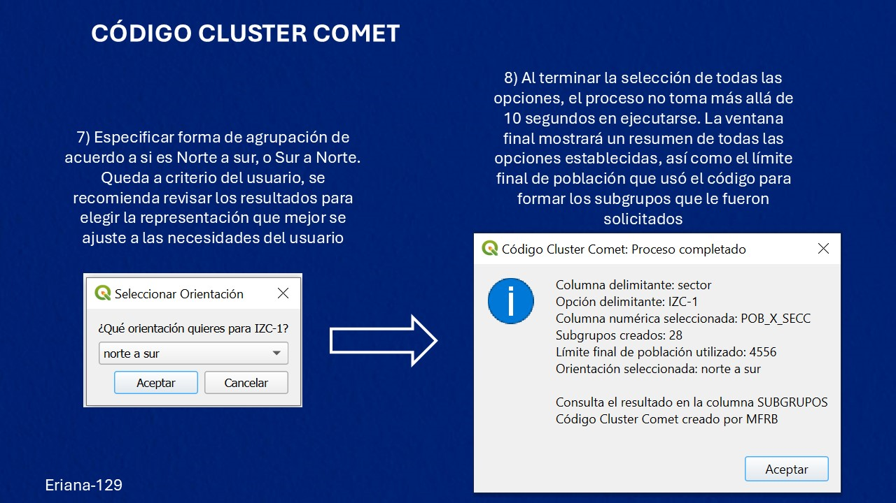
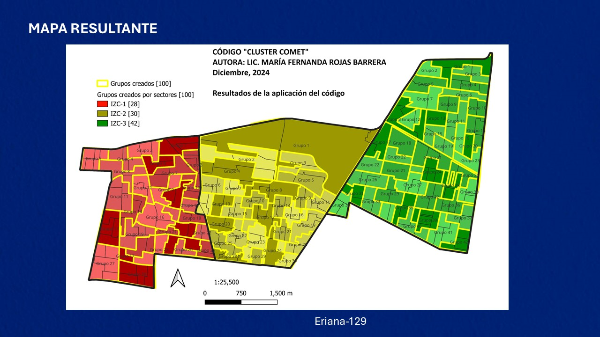

# Codigo_Cluster_Comet
Repositorio para el Código Cluster Comet, que tiene como objetivo crear una columna dentro de la tabla de atributos de una capa vectorial, que permita obtener subgrupos relativamente equilibrados a partir de tres criterios (condicionante, geográfico y numérico) definidos por el usuario. 

## Marco teórico

## Análisis exploratorio de datos

## Pasos clave

## Ejecución del Código Cluster Comet

## ¿Por qué el código se llama Cluster Comet?

El nombre de Cluster Comet, se basa en el las competencias de Micro-raton, específicamente en el ratón Cometa Rojo, de Utsunomiya-san. Más que nada porque cuando estaba realizando el código, en conjunto con chat-gpt, me base en las carreras de microratones, por el hecho de que:

-  Los microratones deben seguir un camino predeterminado con límites físicos (las paredes del laberinto). En mi código, las agrupaciones respetan un límite dinámico basado en la población para formar los subgrupos.
-  Los microratones detectan caminos para avanzar hacia nuevas zonas. En mi código, las entidades vecinas se agrupan una vez que se aproximan lo suficiente al límite y se recorren otros grupos.
-  Los microratones intentan encontrar la solución más rápida o eficiente al laberinto. El código ajusta dinámicamente el límite de población hasta que logra el número de subgrupos establecido por el usuario.
-  Los microratones usan sus caminos de ida y vuelta para mapear el laberinto. El código propone dos enfoques de agrupación, norte a sur y sur a norte. Una mejora a futuro sería que el código pueda entrenarse o mejorarse para que sea capaz de proponer al usuario cuál fue el mejor resultado, ya que actualmente queda a criterio del usuario decidir qué enfoque quiere usar.

